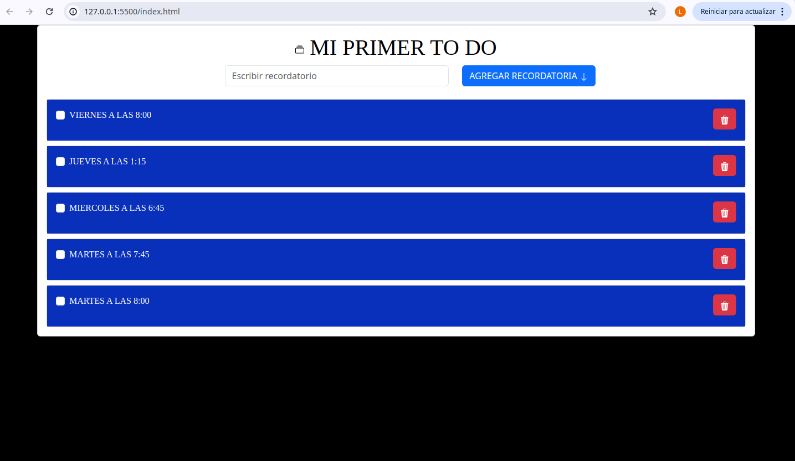

# TO DO DOM 
ESTE ES UN PROYECTO DONDE UTILIZAMOS HTML JAVASCRIT , CSS Y BOOTSTRAP PARA DARLE FUNCIONALIDAD  A LOS BOTONES UTILIZE BOOTSTRAP PARA PONERLE DOS ICONOS AL PROYECTO Y CON CSS LO UTILICE PARA PONERLE UN COLOR , CON HTML Y JAVASCRIT PARA REALIZAR EL CODIGO Y ME DIERA LA FUNCIONALIDAD.

